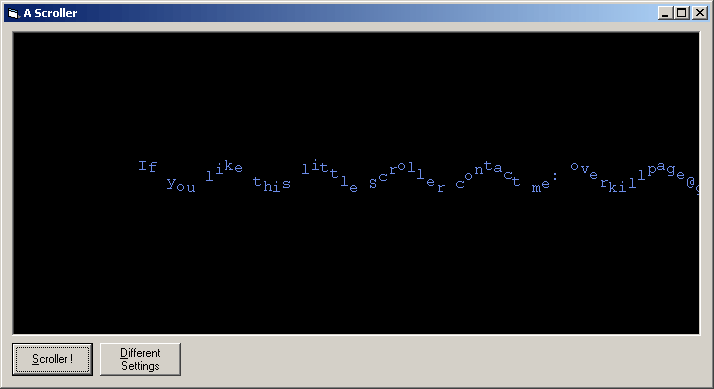



## \[\_ An advanced Scroller \]

### Description

A Scroller Function which allows you to add advanced Scrollers to your Applications. The Syntax is quite simple and I tried to comment as much as possible.

Features:

Setting Text, FontSize, Speed, Up-Down-Movement,Fading Colors or conatant color.
 
### More Info
 
'Scroller NameOfPictureBox, "Your Message", FontSize, Animationspeed, Oscillation, Should Colors constantly change ?, otherwise name the Textcolor here

nice scrolling effect ;)

             |
---                |---
**Submitted On**   |2002-09-24 19:49:02
**By**             |[over](https://github.com/Planet-Source-Code/PSCIndex/blob/master/ByAuthor/over.md)
**Level**          |Intermediate
**User Rating**    |4.8 (58 globes from 12 users)
**Compatibility**  |VB 5\.0, VB 6\.0
**Category**       |[Graphics](https://github.com/Planet-Source-Code/PSCIndex/blob/master/ByCategory/graphics__1-46.md)
**World**          |[Visual Basic](https://github.com/Planet-Source-Code/PSCIndex/blob/master/ByWorld/visual-basic.md)
**Archive File**   |[\[\_\_An\_adva1356849242002\.zip](https://github.com/Planet-Source-Code/over-an-advanced-scroller__1-39237/archive/master.zip)

